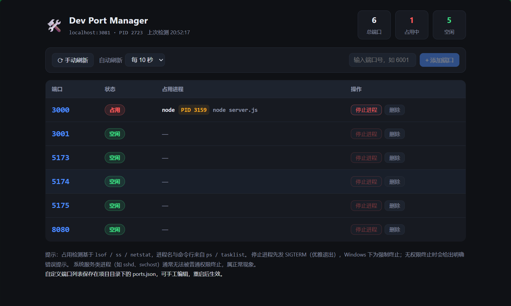

# Dev Port Manager 🛠️

> 🌐 简体中文 | [English](README.en.md)

本机开发服务器端口管理工具：网页实时查看端口占用、解析进程名与 PID、一键停止进程。

- 后端：Node.js + Express（`lsof` / `ss` / `netstat` 检测端口与定位 PID）
- 前端：React 18（UMD 免构建，运行时已固化在 `public/vendor/`，`npm install` 时自动重建）
- 存储：`ports.json`（自定义端口持久化，自动创建，已加入 `.gitignore`）

> 开源协议：[MIT](./LICENSE)



*界面截图：端口列表实时状态、占用进程与 PID、停止进程、添加端口与自动刷新；右上角可切换中英文。*

## 快速开始

前置要求：**Node.js ≥ 16**（React 18 的 UMD 构建已锁定版本，无需任何打包工具）。

```bash
cd dev-port-manager
npm install
npm start
```

浏览器打开 **http://localhost:3081** 即可。

> 工具自身端口可通过环境变量修改：`SERVER_PORT=3082 npm start`
>
> ⚠️ 默认只监听本机回环地址 `127.0.0.1`（防止局域网内其他人调用停止进程的 API）；确需局域网共享时：`HOST=0.0.0.0 npm start`（请确认处在可信网络）。

## 测试

```bash
npm test   # 全 API 回归：自动启动临时实例，跑完清理（CI 同款）
```

## 功能说明

| 功能 | 说明 |
| --- | --- |
| 预置端口 | 10 个常用开发端口：`3000、3001、3002、4200、5000、5173、5174、5175、8000、8080`，首次启动自动写入 `ports.json`（旧版文件会一次性自动补齐，之后删除的不会再加回） |
| 添加/删除端口 | 顶栏输入端口号添加；每行「删除」按钮移除（仅移除监控，不影响进程） |
| 状态检测 | 每次刷新实时查询：空闲（绿）/ 占用（红），占用时显示进程名 + PID + 命令行 |
| 停止进程 | 点击「停止进程」：连同**全部子进程**一起终止（Unix SIGTERM→SIGKILL；Windows `taskkill /T`） |
| 批量停止 | 勾选多行后「停止选中 (n)」，或一键「全部停止」，逐个终止并汇总成功/失败 |
| 端口备注 | 点击备注列直接编辑（≤50 字），保存在 `ports.json` |
| 工具识别 | 自动识别 vite / webpack / next / node / npm / python / java / docker / nginx / 系统服务并打彩色标签 |
| 实时推送 | 开启自动刷新后走 SSE 实时推送（服务端按所选间隔推送，断线自动降级为轮询） |
| 亮色/暗色 | 右上角一键切换（🌙/☀️），默认跟随系统，偏好持久化、刷新无闪烁 |
| 自动刷新 | 工具栏可选关闭 / 每 3 秒 / 每 5 秒 / 每 10 秒 |
| 错误提示 | 杀不掉（系统进程、权限不足）时返回明确错误，不会静默失败 |

## API

| 方法 | 路径 | 说明 |
| --- | --- | --- |
| GET | `/api/ports` | 端口列表 + 实时占用状态 + 备注 |
| POST | `/api/ports` | 添加端口，body `{ "port": 6001 }` |
| DELETE | `/api/ports/:port` | 从列表移除端口 |
| PUT | `/api/ports/:port/note` | 保存/清除备注，body `{ "note": "前端" }`（空串=清除） |
| POST | `/api/kill/:port` | 终止占用端口的进程及其子进程 |
| POST | `/api/kill-all` | 批量终止，body `{ "ports": [...] }`（缺省 = 全部占用中的被监控端口） |
| GET | `/api/ports/events` | SSE 实时推送，`?interval=秒`（默认 2，范围 1–30） |

## 检测机制（跨平台）

| 平台 | 端口→PID | 进程名 / 工具识别 | 终止 |
| --- | --- | --- | --- |
| macOS / Linux | `lsof -nP -iTCP -sTCP:LISTEN`（缺失时降级 `ss -ltnp`；Linux 再无则读 `/proc/net/tcp` + inode 映射） | `ps -o pid=,comm=,args=`，并按命令行自动分类（vite/webpack/node/…） | `process.kill` 整棵进程树：SIGTERM → SIGKILL |
| Windows | `netstat -ano -p tcp` | `tasklist /FO CSV /NH`，按进程名自动分类 | `taskkill /PID <pid> /T`（递归），兜底 `/F` 强杀 |

## 常见问题

- **安全（v1.1 起）**：默认只监听 `127.0.0.1`，局域网内其他设备无法访问接口；确需共享时用 `HOST=0.0.0.0` 启动，并确保处于可信网络。
- **页面打开空白，控制台报 `ReactDOM is not defined` 或资源 404**：先按 `Ctrl+F5` 强制刷新；确认是从浏览器直接访问 `http://localhost:3081`（不要经过代理/预览窗口）。若为手工复制的副本，重新执行 `npm install`（会重建 `public/vendor` 下的前端运行时）再重启。页面本身内置了加载失败自诊断提示，会直接告诉你是哪个资源没加载。
- **停止失败**：提示「权限不足」→ 用管理员/root 身份重新运行工具；提示「仍被占用」→ 进程忽略信号（如系统服务），需手动处理。
- **工具自身端口被占**：启动时报 `EADDRINUSE`，用 `SERVER_PORT=xxxx` 换端口即可。
- **误删端口**：直接编辑 `ports.json` 把端口加回去，或退出重来（默认端口会在文件损坏/缺失时重建）。删除监控不会终止进程，可放心操作。
- **自我保护**：列表中即使加入工具自身端口，终止请求也会被后端拒绝并给出提示。